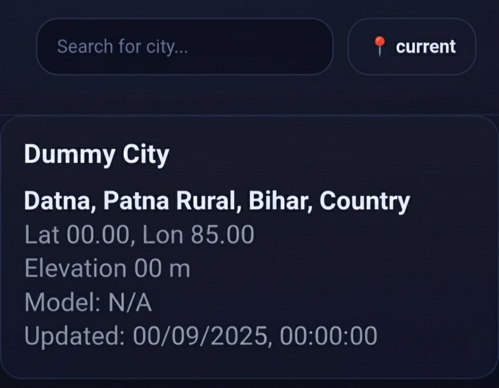
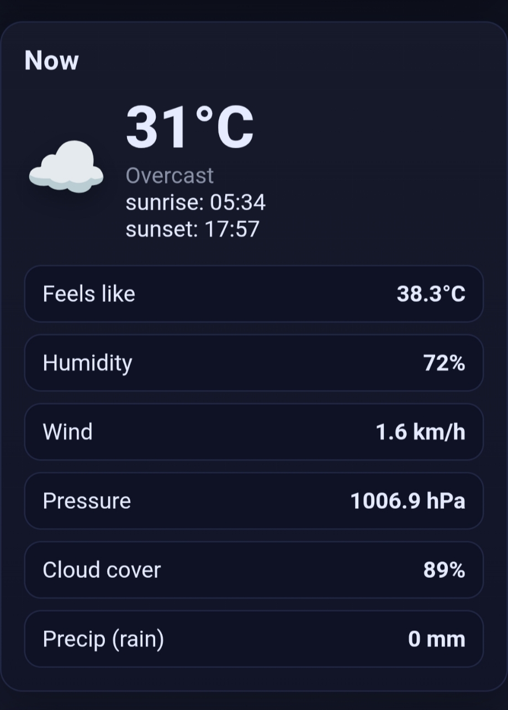
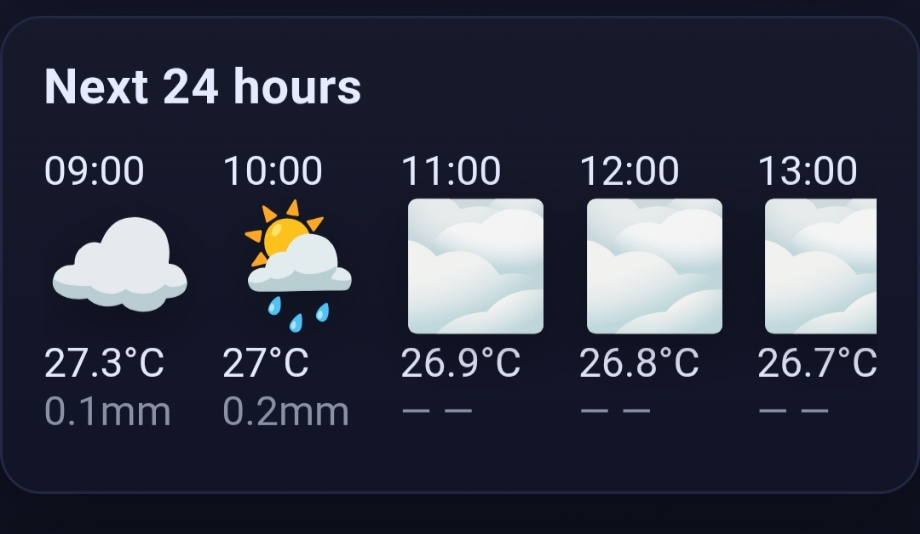
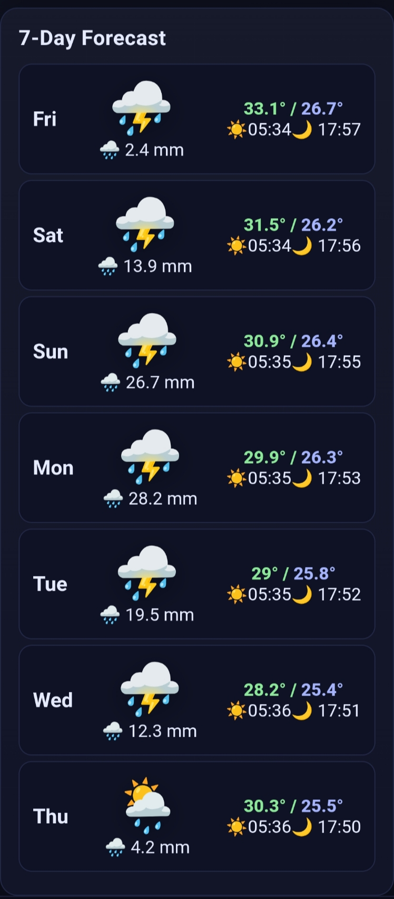

<div align="center">
  
  
  # AETHER WEATHER
  ### Atmospheric Intelligence for the Modern Desktop

  [](https://react.dev/)
  [](https://tailwindcss.com/)
  [](https://www.framer.com/motion/)
  [](https://vitejs.dev/)

  [Live Experience](https://react-weather-app-three-dusky.vercel.app/) • [Report Bug](https://github.com/roshan-soni-1/React-weather-app/issues) • [Request Feature](https://github.com/roshan-soni-1/React-weather-app/issues)

  ---
</div>

## Design Philosophy
Aether is a minimalist weather dashboard designed to prioritize clarity over visual clutter. Utilizing a Bento-style architecture, it organizes complex meteorological data into distinct, digestible tiles. The aesthetic focuses on editorial typography, high-contrast values, and organic textures.

### Key Features
- **Sophisticated UI:** A deep color palette (Indigo, Slate, Rose) paired with subtle grain textures.
- **Bento Architecture:** Logical grouping of data for instant situational awareness.
- **Data Visualization:** Interactive 24-hour temperature trends powered by Recharts.
- **Fluid Motion:** Purposeful entry transitions and layout animations via Framer Motion.
- **Precision Telemetry:** Real-time reverse geocoding via Nominatim/OSM for accurate location tracking.

---

## Technical Stack
| Category | Technology |
| :--- | :--- |
| **Core** | React 19, Tailwind CSS v4 |
| **Visualization** | Recharts, Lucide Icons |
| **Animation** | Framer Motion |
| **Build & Security** | Vite, Terser, CSP Hardening |

---

## Getting Started

### 1. Installation
```bash
git clone https://github.com/roshan-soni-1/React-weather-app.git
cd React-weather-app
```

### 2. Development
```bash
npm install
npm run dev
```

### 3. Build for Production
```bash
npm run build
```

---

## Security & Performance
Aether is optimized for security and delivery speed:
- **Content Security Policy:** Strict CSP headers to prevent unauthorized script execution.
- **Intelligent Chunking:** Heavy libraries are split into separate modules for optimized browser caching.
- **Production Stripping:** Automated removal of console logs and debuggers during the build process.
- **Privacy First:** Keyless location services to ensure user anonymity and zero tracking.

---

## Interface Preview

<div align="center">
  <table border="0">
    <tr>
      <td></td>
      <td></td>
    </tr>
    <tr>
      <td align="center">Minimal Search Interface</td>
      <td align="center">Primary Bento Dashboard</td>
    </tr>
    <tr>
      <td></td>
      <td></td>
    </tr>
    <tr>
      <td align="center">24h Temperature Timeline</td>
      <td align="center">Extended 7-Day Outlook</td>
    </tr>
  </table>
</div>

---

## License
Distributed under the MIT License. See `LICENSE` for more information.

<div align="center">
  <br>
  Built by <b>Roshan Soni</b>
  <br>
  <i>Translating meteorological data into atmospheric experiences.</i>
</div>
